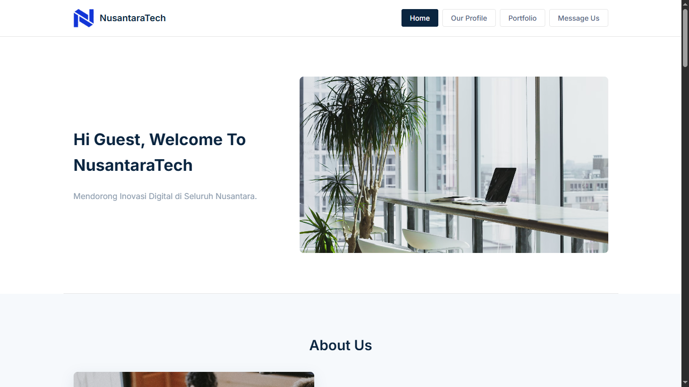
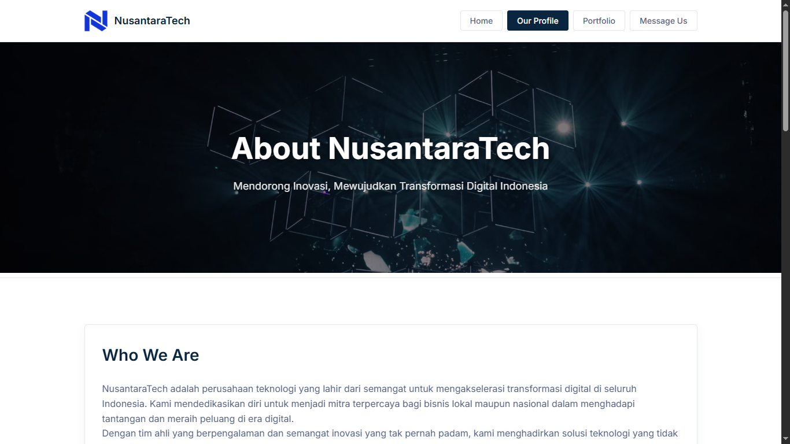

# 🚀 NusantaraTech - Company Profile Website

Selamat datang di repositori **NusantaraTech**, sebuah *landing page* dan profil perusahaan fiktif yang dirancang untuk menampilkan solusi teknologi inovatif. Proyek ini merupakan implementasi dari konsep pengembangan web front-end modern, dibangun dengan fokus pada desain yang bersih, responsivitas, dan interaktivitas pengguna.

Proyek ini dibuat sebagai bagian dari tugas **Mini Coding Project** untuk program **Software Engineering Coding Camp** yang diselenggarakan oleh **RevoU**.

#### Tampilan Halaman Utama (Homepage)

#### Tampilan Halaman Profil



## ✨ Fitur-fitur

-   **Desain Sepenuhnya Responsif:** Tampilan dioptimalkan untuk berbagai perangkat, mulai dari desktop hingga mobile, menggunakan CSS Flexbox dan Grid.
-   **Modal Interaktif:** Pengguna disambut dengan *pop-up* modal untuk memasukkan nama, yang kemudian disimpan di *Local Storage* untuk personalisasi sesi.
-   **Formulir Dinamis:** Bagian "Message Us" memiliki formulir dengan validasi JavaScript yang menampilkan hasilnya secara *real-time* di halaman tanpa perlu *refresh*.
-   **Animasi Scroll (AOS):** Elemen-elemen halaman muncul dengan animasi yang halus saat pengguna melakukan *scroll*, memberikan pengalaman visual yang lebih menarik.
-   **Navigasi Multi-Halaman:** Proyek ini terdiri dari dua halaman utama (Home & Profil) yang terhubung dengan navigasi yang mulus.
-   **Komponen Modern:** Termasuk fitur-fitur seperti *hamburger menu* untuk mobile, *slider* logo partner, dan tombol "Back to Top".
-   **Struktur Kode Bersih:** Penulisan kode HTML, CSS, dan JavaScript yang terorganisir dan mudah dipahami.

## 🛠️ Teknologi yang Digunakan

-   **Struktur:** HTML5
-   **Styling:** CSS3 (Termasuk Flexbox, Grid, Custom Properties, dan Animasi)
-   **Logika & Interaktivitas:** JavaScript (ES6+), berfokus pada manipulasi DOM, *event listeners*, dan *Local Storage*.
-   **Library Eksternal:**
    -   **Animate On Scroll (AOS)** untuk efek animasi saat *scroll*.
    -   **Font Awesome** untuk ikon.
    -   **Google Fonts** untuk tipografi.

Proyek ini sengaja dibangun **tanpa** menggunakan *framework* JavaScript utama seperti React atau Vue untuk memaksimalkan pemahaman dan penerapan fundamental dari teknologi web inti.

## 🚀 Cara Menjalankan Proyek

Karena ini adalah proyek web statis, tidak memerlukan instalasi yang rumit. Ikuti langkah-langkah berikut:

1.  **Clone repositori ini:**
    ```sh
    git clone https://github.com/ofikur/nusantaratech-website.git
    ```

2.  **Masuk ke direktori proyek:**
    ```sh
    cd nusantaratech-website
    ```

3.  **Jalankan di browser:**
    Cara termudah adalah dengan menggunakan ekstensi **Live Server** di Visual Studio Code.
    -   Klik kanan pada file `index.html`.
    -   Pilih "Open with Live Server".

    Alternatif lain adalah dengan membuka file `index.html` langsung di browser Anda.

---

## 📜 Lisensi

Proyek ini dirilis di bawah Lisensi MIT. Lihat file `LICENSE` untuk detail lebih lanjut.

---

### Terima Kasih
Terima kasih sebesar-besarnya kepada [RevoU](https://www.revou.co/id) atas ilmu dan kesempatan yang diberikan selama program Software Engineering Coding Camp.

#### ~ Ofikur R.